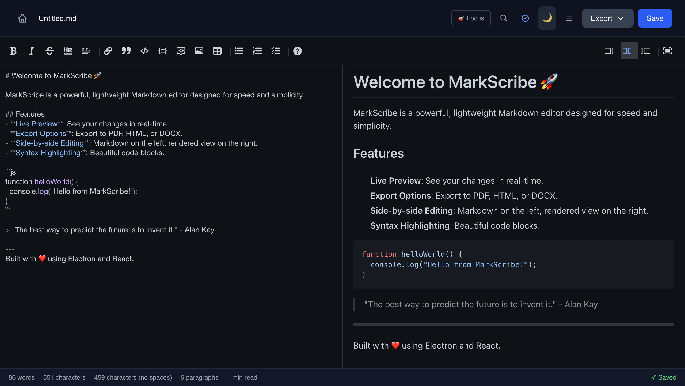
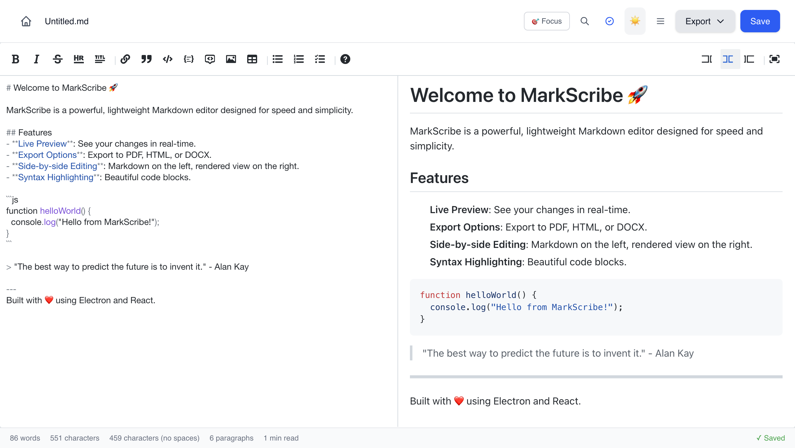
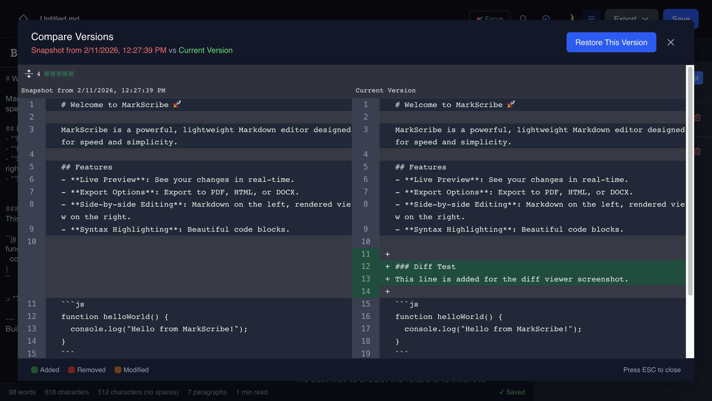

# MarkScribe

> A modern, feature-rich Markdown editor built with Electron, React, and TypeScript

🌐 **[Live Demo & Product Page](https://sneh-joshi.github.io/markscribe/)** | 🚀 **[Try Web Demo](https://sneh-joshi.github.io/markscribe/demo/)**


## ✨ Features

- **📝 Live Preview** - Real-time markdown rendering with syntax highlighting
- **🤖 AI Writing Assistant** - Inline ghost suggestions while you type
- **✨ AI Editor Commands** - Improve, summarize, expand, and grammar fixes
- **🧠 AI Providers** - Configure Ollama (local) or OpenAI in app settings
- **🎨 Multiple View Modes** - Edit, Split, or Preview-only modes
- **🌙 Dark Mode** - Beautiful dark theme with system sync
- **💾 Auto-Save** - Never lose your work
- **📊 Document Statistics** - Word count, character count, reading time
- **🔍 Find & Replace** - Powerful search with regex support
- **📤 Export Options** - Export to PDF, HTML, or DOCX
- **🕐 Version History** - Track changes with automatic snapshots
- **🔄 Diff Viewer** - Compare versions side-by-side
- **⚡ Fast & Lightweight** - Built with performance in mind

## 🚀 Installation

### Build from Source

```bash
# Clone the repository
git clone https://github.com/sneh-joshi/markscribe.git
cd markscribe

# Install dependencies
npm install

# Run in development mode
npm run dev

# Build for production
npm run build:mac    # macOS
npm run build:win    # Windows
npm run build:linux  # Linux
```

## 🎯 Usage

1. **Create or Open** - Start with a new document or open an existing `.md` file
2. **Write** - Use the built-in markdown editor with live preview
3. **Save** - Auto-save keeps your work safe, or use Cmd/Ctrl+S
4. **Export** - Export your document to PDF, HTML, or DOCX
5. **Version Control** - View history and compare changes with the diff viewer

### AI Features

- Open **AI Editor** from the top bar or with `Cmd/Ctrl + Shift + A`
- Use inline suggestions directly in the editor
- Accept full suggestion with `Tab`
- Accept next word with `Cmd/Ctrl + →`
- Dismiss suggestion with `Esc`

### AI Setup (Desktop App)

1. Open **AI Settings**
2. Choose provider: **Ollama** (local) or **OpenAI**
3. For Ollama, ensure the endpoint is running (default `http://127.0.0.1:11434`)
4. Select a model and save configuration
5. Return to editor and start typing to trigger inline suggestions

### AI in Web Demo

- The web demo includes an optional **Connect Ollama** setting
- If browser CORS/origin blocks local Ollama, demo suggestions fall back to mock responses
- Desktop app AI is more reliable for Ollama because requests are routed via Electron IPC

### Keyboard Shortcuts

- `Cmd/Ctrl + S` - Save document
- `Cmd/Ctrl + F` - Find & Replace
- `Cmd/Ctrl + B` - Toggle sidebar
- `Cmd/Ctrl + Shift + A` - Open AI Editor
- `Tab` - Accept inline AI suggestion
- `Cmd/Ctrl + →` - Accept next word of inline suggestion
- `ESC` - Close modals

## 🛠️ Tech Stack

- **[Electron](https://www.electronjs.org/)** - Cross-platform desktop framework
- **[React 19](https://react.dev/)** - UI library
- **[TypeScript](https://www.typescriptlang.org/)** - Type safety
- **[Tailwind CSS](https://tailwindcss.com/)** - Styling
- **[@uiw/react-md-editor](https://github.com/uiwjs/react-md-editor)** - Markdown editor
- **[IndexedDB](https://developer.mozilla.org/en-US/docs/Web/API/IndexedDB_API)** - Version history storage
- **[react-diff-viewer-continued](https://github.com/praneshr/react-diff-viewer)** - Diff comparison

## 📸 Screenshots

### Dark Mode


### Light Mode


### Version History & Diff Viewer


## 🤝 Contributing

Contributions are welcome! Please feel free to submit a Pull Request.

1. Fork the repository
2. Create your feature branch (`git checkout -b feature/AmazingFeature`)
3. Commit your changes (`git commit -m 'Add some AmazingFeature'`)
4. Push to the branch (`git push origin feature/AmazingFeature`)
5. Open a Pull Request

## 📝 License

This project is licensed under the MIT License - see the [LICENSE](LICENSE) file for details.

## 🙏 Acknowledgments

- Inspired by modern markdown editors like Typora and Bear
- Built with amazing open-source libraries
- Thanks to the Electron and React communities
